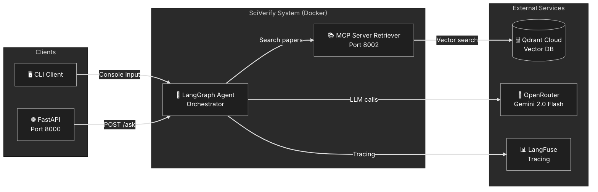

```mermaid
%%{init: {'theme': 'base', 'themeVariables': {
  'background': 'transparent',
  'primaryColor': '#1f1f1f',
  'primaryBorderColor': '#bbbbbb',
  'primaryTextColor': '#ffffff',
  'lineColor': '#e0e0e0',
  'secondaryColor': '#2a2a2a',
  'tertiaryColor': '#2a2a2a',
  'fontFamily': 'Inter, Arial',
  'fontSize': '14px'
}}}%%

flowchart LR

    %% === Clients ===
    subgraph Clients
        CLI[🖥 CLI Client]
        API[🌐 FastAPI<br/>Port 8000]
    end

    %% === Core System ===
    subgraph "SciVerify System (Docker)"
        Agent[🧠 LangGraph Agent<br/>Orchestrator]
        MCP[📚 MCP Server Retriever<br/>Port 8002]
    end

    %% === External Services ===
    subgraph "External Services"
        Qdrant[(🗄 Qdrant Cloud<br/>Vector DB)]
        LLM[🤖 OpenRouter<br/>Gemini 2.0 Flash]
        LangFuse[📊 LangFuse<br/>Tracing]
    end

    %% === Flows ===
    CLI -->|Console input| Agent
    API -->|POST /ask| Agent

    Agent -->|Search papers| MCP
    MCP -->|Vector search| Qdrant

    Agent -->|LLM calls| LLM
    Agent -->|Tracing| LangFuse

    %% === Extra styling for visibility ===
    linkStyle default stroke:#e0e0e0,stroke-width:2px
```