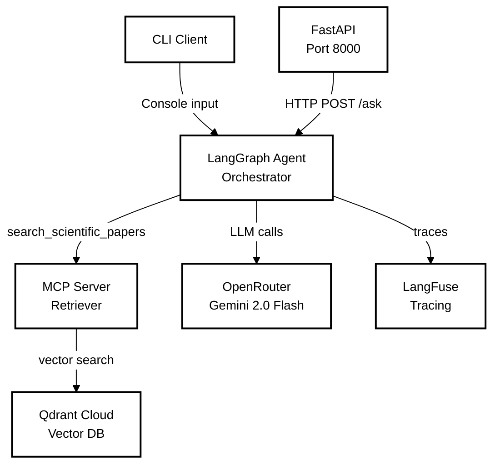

```mermaid
%%{init: {'theme': 'base', 'themeVariables': {
  'background': '#ffffff',
  'primaryColor': '#ffffff',
  'primaryBorderColor': '#000000',
  'primaryTextColor': '#000000',
  'lineColor': '#000000',
  'fontFamily': 'arial',
  'fontSize': '14px'
}}}%%

graph TD
    CLI[CLI Client] -->|Console input| Agent[LangGraph Agent<br/>Orchestrator]
    API[FastAPI<br/>Port 8000] -->|HTTP POST /ask| Agent
    
    Agent -->|search_scientific_papers| MCP[MCP Server<br/>Retriever]
    
    MCP -->|vector search| Qdrant[Qdrant Cloud<br/>Vector DB]
    Agent -->|LLM calls| LLM[OpenRouter<br/>Gemini 2.0 Flash]
    Agent -->|traces| LangFuse[LangFuse<br/>Tracing]
    
    classDef white fill:#ffffff,stroke:#000000,stroke-width:2px,color:#000000
    class CLI,API,Agent,MCP,Qdrant,LLM,LangFuse white
```