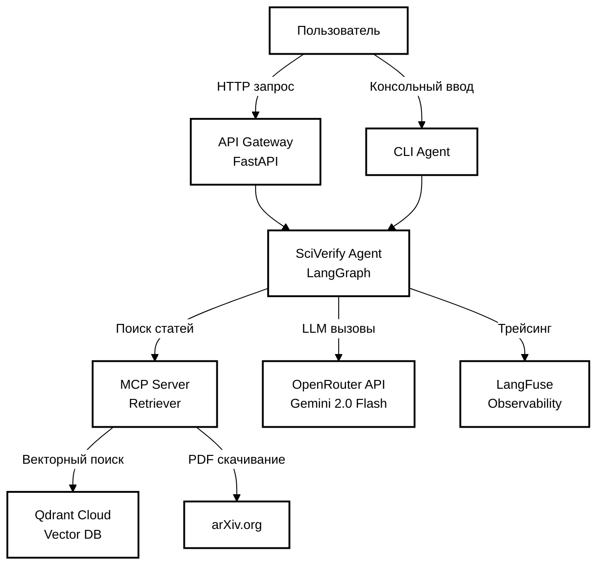

```mermaid
%%{init: {'theme': 'base', 'themeVariables': {
  'background': '#ffffff',
  'primaryColor': '#ffffff',
  'primaryBorderColor': '#000000',
  'primaryTextColor': '#000000',
  'lineColor': '#000000',
  'fontFamily': 'arial',
  'fontSize': '14px'
}}}%%

graph TD
    User[Пользователь] -->|HTTP запрос| API[API Gateway<br/>FastAPI]
    User -->|Консольный ввод| CLI[CLI Agent]
    
    API --> Agent[SciVerify Agent<br/>LangGraph]
    CLI --> Agent
    
    Agent -->|Поиск статей| MCP[MCP Server<br/>Retriever]
    MCP -->|Векторный поиск| Qdrant[Qdrant Cloud<br/>Vector DB]
    
    Agent -->|LLM вызовы| OpenRouter[OpenRouter API<br/>Gemini 2.0 Flash]
    Agent -->|Трейсинг| LangFuse[LangFuse<br/>Observability]
    
    MCP -->|PDF скачивание| ArXiv[arXiv.org]
    
    classDef white fill:#ffffff,stroke:#000000,stroke-width:2px,color:#000000
    class User,API,CLI,Agent,MCP,Qdrant,OpenRouter,LangFuse,ArXiv white
```