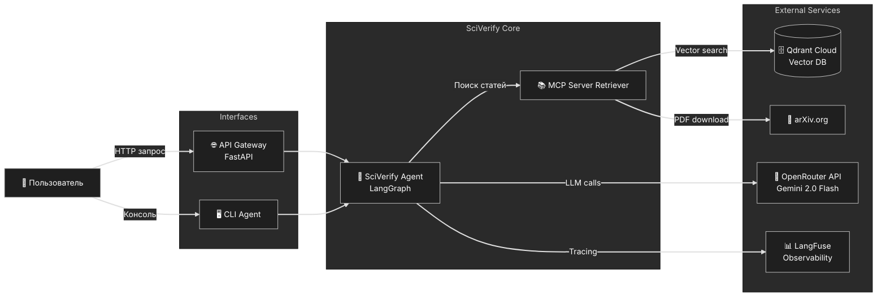

```mermaid
%%{init: {'theme': 'base', 'themeVariables': {
  'background': 'transparent',
  'primaryColor': '#1f1f1f',
  'primaryBorderColor': '#bbbbbb',
  'primaryTextColor': '#ffffff',
  'secondaryColor': '#2a2a2a',
  'tertiaryColor': '#2a2a2a',
  'lineColor': '#e0e0e0',
  'fontFamily': 'Inter, Arial',
  'fontSize': '14px'
}}}%%

flowchart LR

    %% === User Layer ===
    User[👤 Пользователь]

    %% === Interfaces ===
    subgraph Interfaces
        API[🌐 API Gateway<br/>FastAPI]
        CLI[🖥 CLI Agent]
    end

    %% === Core System ===
    subgraph "SciVerify Core"
        Agent[🧠 SciVerify Agent<br/>LangGraph]
        MCP[📚 MCP Server Retriever]
    end

    %% === External Services ===
    subgraph "External Services"
        Qdrant[(🗄 Qdrant Cloud<br/>Vector DB)]
        OpenRouter[🤖 OpenRouter API<br/>Gemini 2.0 Flash]
        LangFuse[📊 LangFuse<br/>Observability]
        ArXiv[📄 arXiv.org]
    end

    %% === Flows ===
    User -->|HTTP запрос| API
    User -->|Консоль| CLI

    API --> Agent
    CLI --> Agent

    Agent -->|Поиск статей| MCP
    MCP -->|Vector search| Qdrant
    MCP -->|PDF download| ArXiv

    Agent -->|LLM calls| OpenRouter
    Agent -->|Tracing| LangFuse

    %% === Visibility fix ===
    linkStyle default stroke:#e0e0e0,stroke-width:2px
```