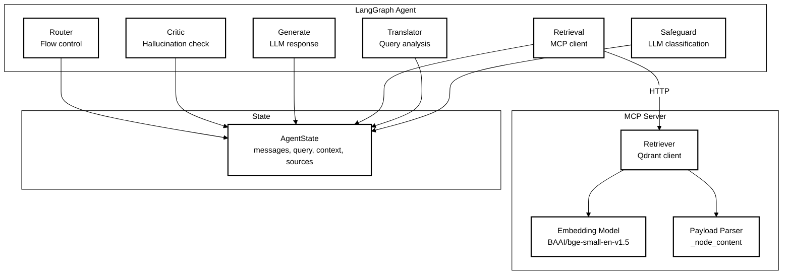

```mermaid
%%{init: {'theme': 'base', 'themeVariables': {
  'background': '#ffffff',
  'primaryColor': '#ffffff',
  'primaryBorderColor': '#000000',
  'primaryTextColor': '#000000',
  'lineColor': '#000000',
  'fontFamily': 'arial',
  'fontSize': '14px'
}}}%%

graph TD
    subgraph LangGraph_Agent [LangGraph Agent]
        Safeguard[Safeguard<br/>LLM classification]
        Translator[Translator<br/>Query analysis]
        Retrieval[Retrieval<br/>MCP client]
        Generate[Generate<br/>LLM response]
        Critic[Critic<br/>Hallucination check]
        Router[Router<br/>Flow control]
    end
    
    subgraph MCP_Server [MCP Server]
        Retriever[Retriever<br/>Qdrant client]
        Embedding[Embedding Model<br/>BAAI/bge-small-en-v1.5]
        Parser[Payload Parser<br/>_node_content]
    end
    
    subgraph State [State]
        StateBox[AgentState<br/>messages, query, context, sources]
    end
    
    Safeguard --> StateBox
    Translator --> StateBox
    Retrieval --> StateBox
    Generate --> StateBox
    Critic --> StateBox
    Router --> StateBox
    
    Retrieval -->|HTTP| Retriever
    Retriever --> Embedding
    Retriever --> Parser
    
    classDef white fill:#ffffff,stroke:#000000,stroke-width:2px,color:#000000
    classDef subgraphStyle fill:#ffffff,stroke:#000000,stroke-width:1px,color:#000000
    
    class Safeguard,Translator,Retrieval,Generate,Critic,Router,StateBox,Retriever,Embedding,Parser white
    class LangGraph_Agent,MCP_Server,State subgraphStyle

```