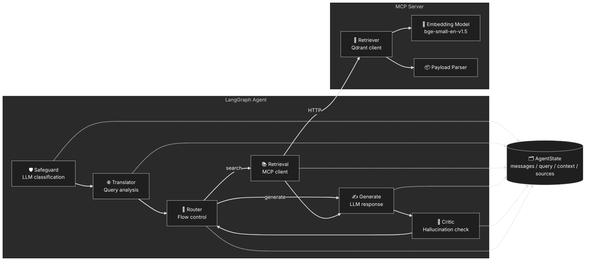

```mermaid
%%{init: {'theme': 'base', 'themeVariables': {
  'background': 'transparent',
  'primaryColor': '#1f1f1f',
  'primaryBorderColor': '#bbbbbb',
  'primaryTextColor': '#ffffff',
  'secondaryColor': '#2a2a2a',
  'tertiaryColor': '#2a2a2a',
  'lineColor': '#e0e0e0',
  'fontFamily': 'Inter, Arial',
  'fontSize': '14px'
}}}%%

flowchart LR

    %% === LangGraph Agent ===
    subgraph "LangGraph Agent"
        Safeguard[🛡 Safeguard<br/>LLM classification]
        Translator[🌐 Translator<br/>Query analysis]
        Router[🔀 Router<br/>Flow control]
        Retrieval[📚 Retrieval<br/>MCP client]
        Generate[✍️ Generate<br/>LLM response]
        Critic[🧪 Critic<br/>Hallucination check]
    end

    %% === MCP Server ===
    subgraph "MCP Server"
        Retriever[🔎 Retriever<br/>Qdrant client]
        Embedding[🧠 Embedding Model<br/>bge-small-en-v1.5]
        Parser[📦 Payload Parser]
    end

    %% === State ===
    StateBox[(🗂 AgentState<br/>messages / query / context / sources)]

    %% === Main Flow ===
    Safeguard --> Translator --> Router

    Router -->|search| Retrieval
    Router -->|generate| Generate

    Retrieval --> Generate
    Generate --> Critic
    Critic --> Router

    %% === MCP interaction ===
    Retrieval -->|HTTP| Retriever
    Retriever --> Embedding
    Retriever --> Parser

    %% === State connections (simplified) ===
    Safeguard -.-> StateBox
    Translator -.-> StateBox
    Retrieval -.-> StateBox
    Generate -.-> StateBox
    Critic -.-> StateBox
    Router -.-> StateBox

    %% === Visibility fix ===
    linkStyle default stroke:#e0e0e0,stroke-width:2px
```