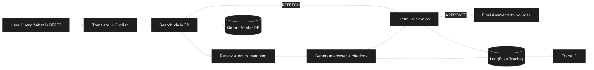

```mermaid
%%{init: {'theme': 'base', 'themeVariables': {
  'background': 'transparent',
  'primaryColor': '#1f1f1f',
  'primaryBorderColor': '#bbbbbb',
  'primaryTextColor': '#ffffff',
  'secondaryColor': '#2a2a2a',
  'tertiaryColor': '#2a2a2a',
  'lineColor': '#e0e0e0',
  'fontFamily': 'Inter, Arial',
  'fontSize': '14px'
}}}%%

flowchart LR

    %% === Input ===
    Query["User Query: What is BERT?"]

    %% === Pipeline ===
    Translate["Translate → English"]
    Search["Search via MCP"]
    Rerank["Rerank + entity matching"]
    Generate["Generate answer + citations"]
    Critic["Critic verification"]
    Answer["Final Answer with sources"]

    %% === Storage / Services ===
    Qdrant[(Qdrant Vector DB)]
    LangFuse[(LangFuse Tracing)]
    Trace["Trace ID"]

    %% === Main Flow ===
    Query --> Translate --> Search
    Search --> Rerank --> Generate --> Critic

    Critic -->|APPROVED| Answer
    Critic -->|REFETCH| Search

    %% === External interactions ===
    Search --> Qdrant

    %% === Observability ===
    Generate --> LangFuse
    Critic --> LangFuse
    LangFuse --> Trace

    %% === Visibility fix ===
    linkStyle default stroke:#e0e0e0,stroke-width:2px
```