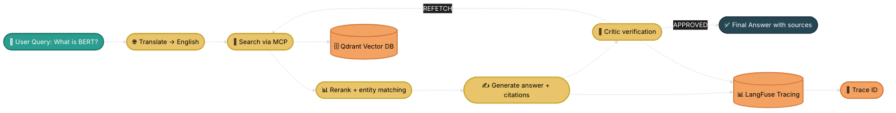

```mermaid
%%{init: {'theme': 'base', 'themeVariables': {
  'background': 'transparent',
  'primaryColor': '#1f1f1f',
  'primaryBorderColor': '#bbbbbb',
  'primaryTextColor': '#ffffff',
  'lineColor': '#e0e0e0',
  'fontFamily': 'Inter, Arial',
  'fontSize': '14px'
}}}%%

flowchart LR
    %% === Input ===
    Query(["👤 User Query: What is BERT?"]):::input

    %% === Pipeline ===
    Translate(["🌐 Translate → English"]):::process
    Search(["🔎 Search via MCP"]):::process
    Rerank(["📊 Rerank + entity matching"]):::process
    Generate(["✍️ Generate answer + citations"]):::process
    Critic(["🧪 Critic verification"]):::process
    Answer(["✅ Final Answer with sources"]):::output

    %% === Storage / Services ===
    Qdrant[(🗄 Qdrant Vector DB)]:::storage
    LangFuse[(📊 LangFuse Tracing)]:::storage
    Trace(["🧾 Trace ID"]):::storage

    %% === Main Flow ===
    Query --> Translate --> Search
    Search --> Rerank --> Generate --> Critic
    Critic -->|APPROVED| Answer
    Critic -->|REFETCH| Search

    %% === External interactions ===
    Search --> Qdrant

    %% === Observability ===
    Generate --> LangFuse
    Critic --> LangFuse
    LangFuse --> Trace

    %% === Styling ===
    classDef input fill:#2a9d8f,stroke:#1f776f,color:#ffffff,stroke-width:2px
    classDef process fill:#e9c46a,stroke:#c7a52c,color:#000000,stroke-width:2px
    classDef output fill:#264653,stroke:#1e353f,color:#ffffff,stroke-width:2px
    classDef storage fill:#f4a261,stroke:#d1783b,color:#000000,stroke-width:2px
```