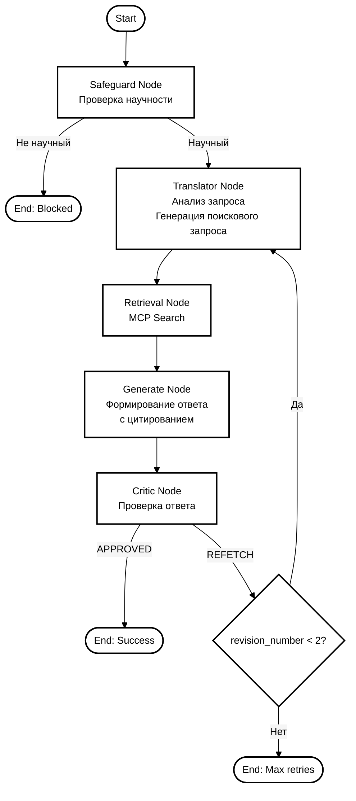

```mermaid
%%{init: {'theme': 'base', 'themeVariables': {
  'background': '#ffffff',
  'primaryColor': '#ffffff',
  'primaryBorderColor': '#000000',
  'primaryTextColor': '#000000',
  'lineColor': '#000000',
  'secondaryColor': '#f5f5f5',
  'tertiaryColor': '#ffffff',
  'fontFamily': 'arial',
  'fontSize': '14px'
}}}%%

graph TD
    Start([Start]) --> Safeguard[Safeguard Node<br/>Проверка научности]
    
    Safeguard -->|Не научный| End1([End: Blocked])
    Safeguard -->|Научный| Translator[Translator Node<br/>Анализ запроса<br/>Генерация поискового запроса]
    
    Translator --> Retrieval[Retrieval Node<br/>MCP Search]
    
    Retrieval --> Generate[Generate Node<br/>Формирование ответа<br/>с цитированием]
    
    Generate --> Critic[Critic Node<br/>Проверка ответа]
    
    Critic -->|APPROVED| End2([End: Success])
    Critic -->|REFETCH| CheckTurn{revision_number < 2?}
    
    CheckTurn -->|Да| Translator
    CheckTurn -->|Нет| End3([End: Max retries])
    
    style Start fill:#ffffff,stroke:#000000,stroke-width:2px,color:#000000
    style Safeguard fill:#ffffff,stroke:#000000,stroke-width:2px,color:#000000
    style Translator fill:#ffffff,stroke:#000000,stroke-width:2px,color:#000000
    style Retrieval fill:#ffffff,stroke:#000000,stroke-width:2px,color:#000000
    style Generate fill:#ffffff,stroke:#000000,stroke-width:2px,color:#000000
    style Critic fill:#ffffff,stroke:#000000,stroke-width:2px,color:#000000
    style CheckTurn fill:#ffffff,stroke:#000000,stroke-width:2px,color:#000000
    style End1 fill:#ffffff,stroke:#000000,stroke-width:2px,color:#000000
    style End2 fill:#ffffff,stroke:#000000,stroke-width:2px,color:#000000
    style End3 fill:#ffffff,stroke:#000000,stroke-width:2px,color:#000000
```