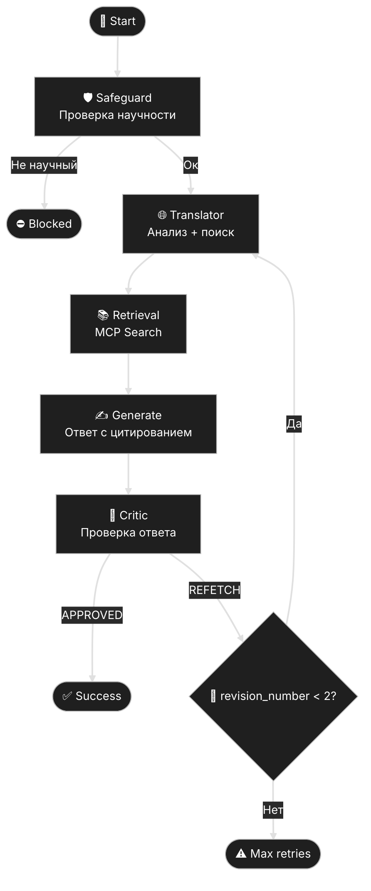

```mermaid
%%{init: {'theme': 'base', 'themeVariables': {
  'background': 'transparent',
  'primaryColor': '#1f1f1f',
  'primaryBorderColor': '#bbbbbb',
  'primaryTextColor': '#ffffff',
  'secondaryColor': '#2a2a2a',
  'tertiaryColor': '#2a2a2a',
  'lineColor': '#e0e0e0',
  'fontFamily': 'Inter, Arial',
  'fontSize': '14px'
}}}%%

flowchart TD

    %% === Start ===
    Start([🚀 Start])

    %% === Core Flow ===
    Safeguard[🛡 Safeguard<br/>Проверка научности]
    Translator[🌐 Translator<br/>Анализ + поиск]
    Retrieval[📚 Retrieval<br/>MCP Search]
    Generate[✍️ Generate<br/>Ответ с цитированием]
    Critic[🧪 Critic<br/>Проверка ответа]

    %% === Decisions ===
    CheckTurn{🔁 revision_number < 2?}

    %% === End States ===
    EndBlocked([⛔ Blocked])
    EndSuccess([✅ Success])
    EndRetry([⚠️ Max retries])

    %% === Flow ===
    Start --> Safeguard

    Safeguard -->|Не научный| EndBlocked
    Safeguard -->|Ок| Translator

    Translator --> Retrieval --> Generate --> Critic

    Critic -->|APPROVED| EndSuccess
    Critic -->|REFETCH| CheckTurn

    CheckTurn -->|Да| Translator
    CheckTurn -->|Нет| EndRetry

    %% === Visibility fix ===
    linkStyle default stroke:#e0e0e0,stroke-width:2px
```