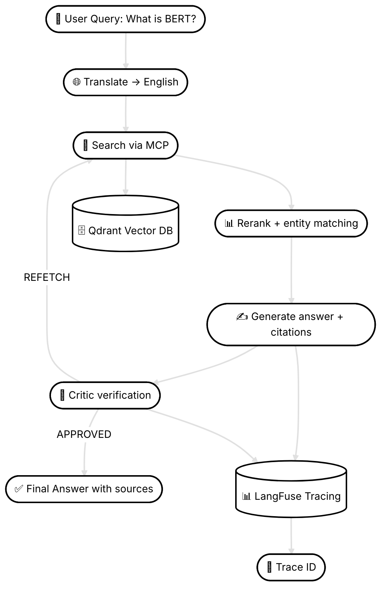

```mermaid
%%{init: {'theme': 'base', 'themeVariables': {
  'background': 'transparent',
  'primaryColor': '#ffffff',
  'primaryBorderColor': '#000000',
  'primaryTextColor': '#000000',
  'lineColor': '#e0e0e0',
  'fontFamily': 'Inter, Arial',
  'fontSize': '14px'
}}}%%

flowchart TD
    %% === Input ===
    Query(["👤 User Query: What is BERT?"])

    %% === Pipeline ===
    Translate(["🌐 Translate → English"])
    Search(["🔎 Search via MCP"])
    Rerank(["📊 Rerank + entity matching"])
    Generate(["✍️ Generate answer + citations"])
    Critic(["🧪 Critic verification"])
    Answer(["✅ Final Answer with sources"])

    %% === Storage / Services ===
    Qdrant[(🗄 Qdrant Vector DB)]
    LangFuse[(📊 LangFuse Tracing)]
    Trace(["🧾 Trace ID"])

    %% === Main Flow ===
    Query --> Translate --> Search
    Search --> Rerank --> Generate --> Critic
    Critic -->|APPROVED| Answer
    Critic -->|REFETCH| Search

    %% === External interactions ===
    Search --> Qdrant

    %% === Observability ===
    Generate --> LangFuse
    Critic --> LangFuse
    LangFuse --> Trace

    %% === Styling (same as original) ===
    classDef white fill:#ffffff,stroke:#000000,stroke-width:2px,color:#000000
    class Query,Translate,Search,Rerank,Generate,Critic,Answer,Qdrant,LangFuse,Trace white

    %% === Visibility fix ===
    linkStyle default stroke:#e0e0e0,stroke-width:2px
```