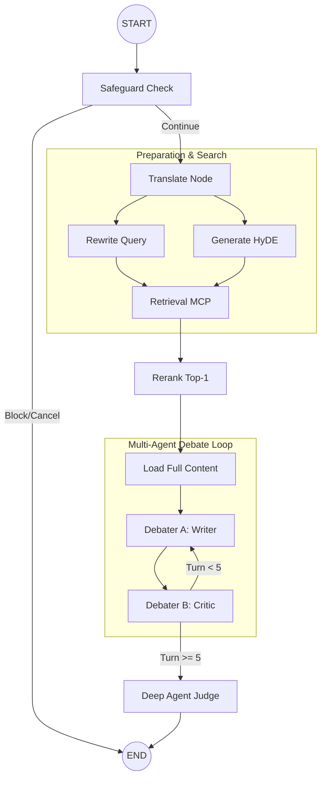

# 🧠 Module Specification: Orchestrator (LangGraph)

## 1. Назначение
Оркестратор — это центральный управляющий компонент системы SciVerify, реализованный на базе **LangGraph**. Он координирует работу всех агентов, управляет состоянием (State), обрабатывает поисковую выдачу от MCP-сервера и обеспечивает качество ответа через итеративный цикл дебатов.

---

## 2. Архитектура графа

### Визуальная структура потока


---

## 3. Схема состояния (OrchestratorState)

Состояние является «единым источником истины» для всех узлов графа.

```python
from typing import Annotated, List, Dict, Any, TypedDict
from langchain_core.messages import BaseMessage
from langgraph.graph.message import add_messages

class OrchestratorState(TypedDict):
    # Входные данные
    messages: Annotated[List[BaseMessage], add_messages]
    
    # Флаги управления
    next_action: str          # CONTINUE | BLOCK | CANCEL
    translated_query: str     # Запрос на английском
    
    # Подготовка поиска
    rewritten_query: str      # Оптимизированный запрос
    hyde_document: str        # Гипотетический ответ (HyDE)
    
    # Данные поиска
    rag_results: List[Dict[str, Any]]  # Список чанков из Qdrant
    best_article_path: str             # Путь к выбранной статье
    
    # Дебаты
    article_markdown: str     # Полный текст статьи (контекст)
    debate_history: Annotated[List[BaseMessage], add_messages]
    turn_count: int           # Счетчик итераций (max 5)
    
    # Результат
    final_answer: str         # Итоговый верифицированный ответ
```

---

## 4. Описание ключевых узлов

### 4.1 Safeguard & Translation
*   **Safeguard**: Классифицирует намерение пользователя. Если запрос не касается науки или нарушает политики безопасности, граф завершается немедленно.
*   **Translator**: Переводит запрос на английский язык, сохраняя техническую терминологию, для обеспечения максимального Recall в англоязычных базах данных.

### 4.2 Retrieval & Rerank
*   **Retrieval**: Параллельно вызывает MCP-сервер с тремя типами запросов (оригинальный, переписанный, HyDE) по всем коллекциям.
*   **Rerank**: LLM анализирует сниппеты топ-10 результатов и выбирает **одну** наиболее релевантную статью для глубокого анализа, возвращая её `file_path`.

### 4.3 Debate Loop (The Core)
*   **Debater A (Writer)**: Формирует ответ, опираясь исключительно на предоставленный Markdown-текст статьи.
*   **Debater B (Critic)**: Анализирует ответ оппонента на наличие галлюцинаций, фактических ошибок или пропущенных нюансов, требуя исправлений.
*   **Цикл**: Повторяется до достижения консенсуса или лимита в 5 ходов.

### 4.4 Deep Agent (Judge)
Финальный узел, который анализирует историю спора агентов, сопоставляет её с исходным текстом статьи и формирует эталонный ответ с цитированием.

---

## 5. Политики отказоустойчивости

| Узел | Стратегия Retry | Fallback (при отказе) |
|:---|:---|:---|
| **Safeguard** | 2 попытки | BLOCK (безопасный отказ) |
| **Retrieval** | 3 попытки (Exponential Backoff) | Пустой список результатов |
| **Rerank** | 2 попытки | Выбор первого элемента в списке |
| **Debate** | 2 попытки | Использование последнего ответа Debater_A |
| **Deep Agent** | 2 попытки | Прямой возврат последнего сообщения из дебатов |

---

## 6. Экономика и производительность

### Оценка стоимости (на базе Gemini 2.0/2.5)
| Этап | Модель | Цена за вызов |
|:---|:---|:---|
| Анализ и Поиск | Gemini 2.0 Flash | ~$0.01 |
| Дебаты (5 ходов) | Gemini 2.5 Pro | ~$0.10 |
| Финальный Judge | Gemini 2.5 Pro | ~$0.03 |
| **ИТОГО** | **Средний запрос** | **~$0.14** |

### Лимиты контекста
*   **Markdown статьи**: Обрезается до **50,000 токенов** для сохранения точности Debater-агентов.
*   **Общий таймаут**: 90 секунд на весь цикл графа.

---

## 7. Мониторинг (Logging)
Каждое прохождение узла фиксируется в **LangFuse** со следующими метаданными:
*   `trace_id`: Уникальный ID сессии.
*   `node_name`: Название текущего шага.
*   `tokens_used`: Количество затраченных токенов.
*   `turn_count`: Текущая итерация цикла дебатов.
