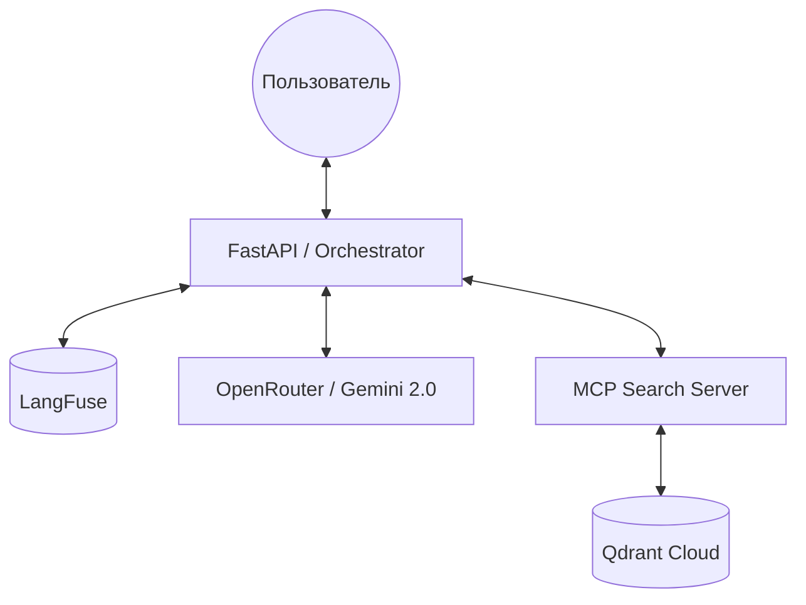
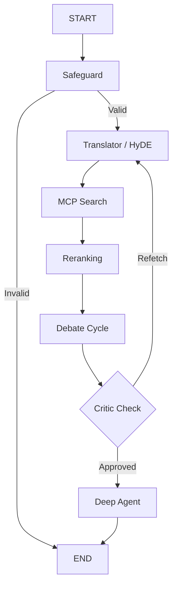

# 🏗️ System Design: SciVerify Agent

## 1. Обзор системы
**SciVerify Agent** — это продвинутая RAG-система (Retrieval-Augmented Generation) с мультиагентной верификацией, предназначенная для анализа научных статей из базы arXiv. Система построена на базе **LangGraph** и использует протокол **MCP** для изоляции логики поиска.

### Ключевые показатели
*   **Функциональные**: Ответы на научные вопросы с обязательным цитированием первоисточников.
*   **Производительность**: p95 latency < 30 сек.
*   **Инфраструктура**: Qdrant (Vector DB), LangFuse (Observability).

---

## 2. Архитектурные решения (ADR)

| ID | Решение | Обоснование | Статус |
|:---|:---|:---|:---|
| **ADR-001** | **MCP сервер для поиска** | Изоляция retrieval-логики, возможность горизонтального масштабирования поиска отдельно от агента. | ✅ Реализовано |
| **ADR-002** | **Двухуровневый реранкинг** | Сначала LLM выбирает статью по метаданным (дешево), затем идет глубокий анализ текста (качественно). | ✅ Реализовано |
| **ADR-003** | **LangGraph для оркестрации** | Необходимость управления сложными циклами (Debate), условиями и состоянием (State). | ✅ Реализовано |
| **ADR-004** | **Специализированные индексы** | Использование разных стратегий чанкинга (Small/Big) и синтетических вопросов для повышения Recall. | ✅ Реализовано |
| **ADR-005** | **Цикл Critic + Router** | Автоматическая проверка ответов на галлюцинации перед выдачей пользователю. | ✅ Реализовано |

---

## 3. Архитектура системы

### Компоненты системы


### Обязанности модулей
| Модуль | Технология | Обязанности |
|:---|:---|:---|
| **Оркестратор** | LangGraph | Управление потоком, хранение состояния, вызовы LLM. |
| **MCP Сервер** | FastMCP | Поисковое API, гибридный поиск по 5 коллекциям. |
| **Vector DB** | Qdrant | Хранение векторов, быстрый поиск и фильтрация. |
| **Индексация** | Python / Ingest | Парсинг PDF, генерация саммари, загрузка в БД. |

---

## 4. Поток выполнения (Workflow)

### Структура графа


---

## 5. Управление состоянием

Система использует `UnifiedState` для передачи данных между узлами:

```python
class UnifiedState(TypedDict):
    messages: Annotated[List[BaseMessage], add_messages] # История диалога
    translated_query: str     # Запрос на английском
    hyde_document: str        # Гипотетический ответ
    rag_results: List[Dict]   # Результаты из Qdrant
    best_article: str         # Путь к выбранной статье
    turn_count: int           # Счетчик итераций дебатов
    final_answer: str         # Итоговый ответ
```

---

## 6. Архитектура поиска

### Структура индексов
| Коллекция | Назначение |
|:---|:---|
| `normal_chunks` | Основной поиск (512-1024 токенов). |
| `big_chunks` | Сохранение широкого контекста статьи. |
| `summary_chunks` | Быстрая фильтрация по аннотациям. |
| `questions_chunks` | Поиск по синтетическим вопросам к статьям. |

---

## 7. Обработка ошибок и отказоустойчивость

*   **LLM API**: Retry (3x) при таймаутах или 5xx ошибках.
*   **Qdrant**: При отказе соединения возвращается пустой результат (Graceful degradation).
*   **Контекст**: Если Markdown статьи слишком велик, применяется динамическая обрезка до 200k токенов.
*   **Галлюцинации**: Узел `Critic` принудительно отправляет агента на повторный поиск (`REFETCH`), если ответ не подтвержден источником.

---

## 8. Наблюдаемость (Observability)

*   **Трейсинг**: Каждый шаг графа логируется в LangFuse как отдельный Span.
*   **Метрики**: Отслеживание стоимости (Token Usage), задержки (Latency) и частоты галлюцинаций.
*   **Алертинг**: Уведомления в Slack при Error Rate > 10% или превышении дневного бюджета.

---

## 9. Реализованная архитектура (Status Quo)

### Фактические показатели MVP
*   **Модель**: `google/gemini-2.0-flash-001` через OpenRouter.
*   **Embeddings**: `BAAI/bge-small-en-v1.5` (384 dim).
*   **Данные**: 100 статей, 3369 векторов в `collection_normal_chunks`.
*   **Экономика**: ~$0.14 за сложный запрос с верификацией.

---

## 10. Диаграммы и документация

| Документ | Ссылка |
|:---|:---|
| **C4 Context Diagram** | [Перейти](./diagrams/c4-context.md) |
| **Workflow Diagram** | [Перейти](./diagrams/workflow.md) |
| **Retriever Spec** | [Перейти](./specs/retriever-spec.md) |
| **Deployment Spec** | [Перейти](./specs/deployment-spec.md) |
| **Observability Spec** | [Перейти](./specs/observability-spec.md) |

---

## 11. Ограничения

*   **Технические**: Лимит контекстного окна 200k токенов (для стабильности).
*   **Бюджет**: Жесткий лимит $200/мес на API.
*   **Вне скоупа**: Потоковая передача (streaming) и многопользовательские сессии (в текущей версии).